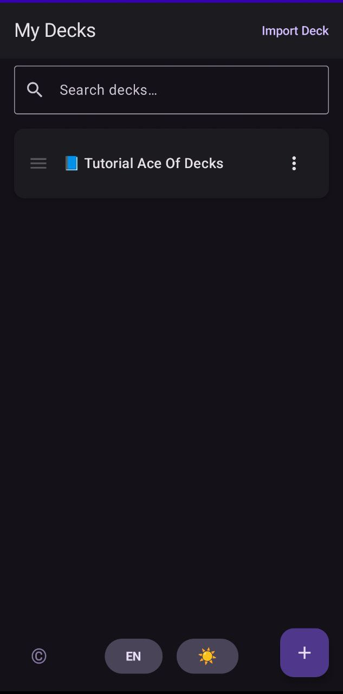
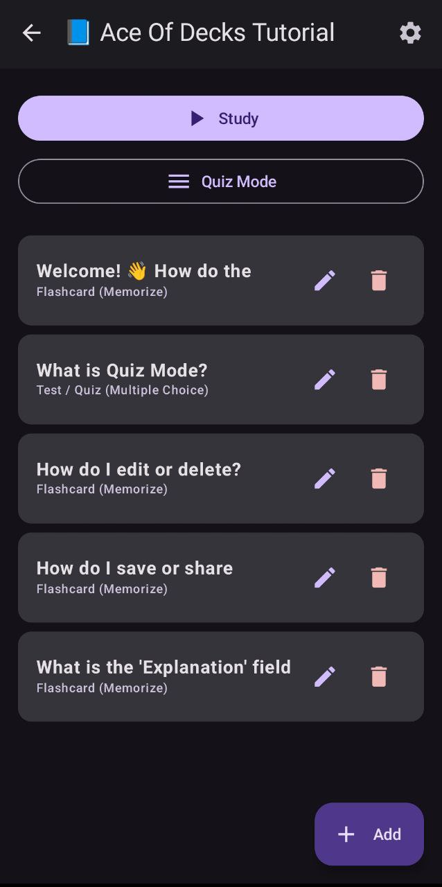
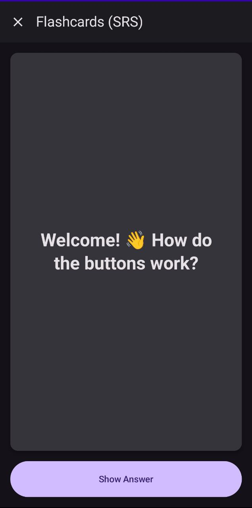
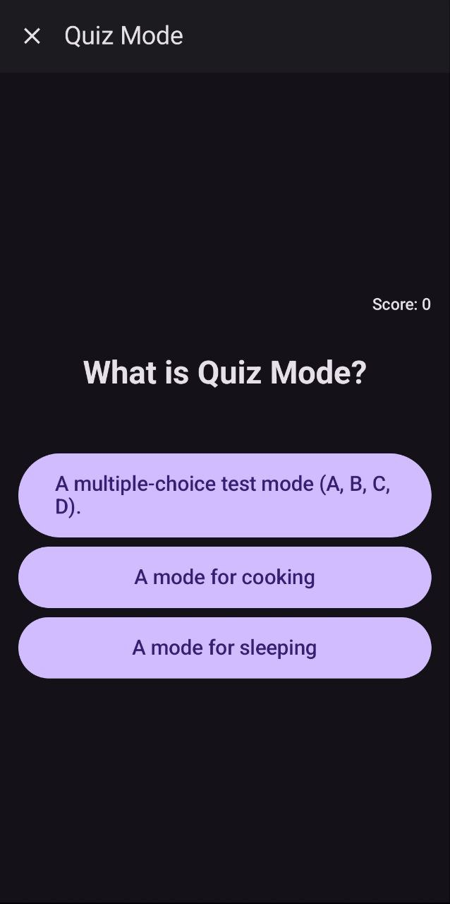

# 🃏 Ace Of Decks

<div align="center">


<br>

[🇪🇸 Español](#-ace-of-decks-español) | [🇺🇸 English](#-ace-of-decks-english)

</div>

---

# 🇪🇸 Ace Of Decks (Español)

> **"Creado con cafeína ☕, falta de sueño y Código Abierto."**

**Ace Of Decks** es una aplicación de estudio moderna y FOSS (Free and Open Source Software) diseñada para ayudarte a memorizar cualquier cosa mediante **Flashcards** y **Repaso Espaciado (SRS)**. Sin anuncios, sin rastreadores, sin complicaciones.

## 📱 Capturas de Pantalla

| Inicio | Editor | Modo Estudio | Modo Examen |
|:---:|:---:|:---:|:---:|
|  |  |  |  |

## 🚀 Características Principales

* **⚡ 100% Jetpack Compose:** Interfaz moderna, fluida y adaptativa (Material Design 3).
* **🧠 Algoritmo SRS Inteligente:** Basado en una versión modificada de SM-2 para optimizar la retención.
* **📝 Editor Potente:** Crea Flashcards clásicas o tarjetas tipo Test con respuestas múltiples.
* **📊 Modo Examen:** Ponte a prueba con preguntas tipo test generadas aleatoriamente.
* **💾 Importación/Exportación JSON:** Tus datos son tuyos. Comparte mazos fácilmente.
* **🌑 Modo Oscuro:** Cuidado nativo para tus ojos (y tu batería).
* **🔒 Privacidad Total:** Sin conexión a internet, los datos viven en tu dispositivo.

## 🛠️ Ace Of Decks Workshop (Descargar Mazos)

¿No quieres empezar desde cero? Visita nuestro repositorio comunitario para descargar mazos creados por otros usuarios:

👉 **[Ir al Ace Of Decks Workshop](https://github.com/TheInkReaper/AceOfDecks-Workshop)**

## ⚠️ Aviso Legal y Mazos Compartidos

Si decides compartir tus mazos `.json` con la comunidad o descargarlos de internet, ten en cuenta:

* **PERMITIDO:** Mazos creados por ti, apuntes propios, datos de dominio público (Leyes BOE, DGT oficial) y hechos generales.
* **PROHIBIDO:** Material con Copyright, copias directas de libros de texto editoriales o bases de datos extraídas de otras aplicaciones comerciales.
* **Responsabilidad:** El usuario es el único responsable del contenido que importa en la aplicación.

## 🤓 Cómo Funciona (Deep Dive)

### El Algoritmo de Repaso (SRS)
Ace Of Decks utiliza una implementación personalizada del algoritmo **SM-2**. La diferencia clave respecto al estándar es el manejo de los fallos:

* **AGAIN (Fallo):** El intervalo se resetea a **0 días**. Esto garantiza que la carta vuelva a aparecer en la **misma sesión** de estudio hasta que la aciertes, reforzando el aprendizaje inmediato.
* **HARD / GOOD / EASY:** Ajustan el "Factor de Facilidad" (Ease Factor) y multiplican el intervalo de días para la siguiente revisión.

## 👩‍💻 Cómo crear mazos manualmente (PC)

¿Prefieres escribir tus preguntas en el ordenador? Puedes crear un archivo `.json` e importarlo en la app.

### Estructura del archivo JSON
Copia esta plantilla, guárdala como `mi_mazo.json` y edítala con tus preguntas:

```json
{
  "deck": {
    "name": "Mazo de Ejemplo",
    "studyLimitPerSession": 20,
    "quizLimitPerSession": 10
  },
  "cards": [
    {
      "type": "FLASHCARD",
      "question": "Pregunta o concepto (Anverso)",
      "answer": "Respuesta (Reverso)",
      "explanation": "Nota extra opcional que sale al responder",
      "wrongAnswers": []
    },
    {
      "type": "TEST",
      "question": "¿Cuál es la velocidad máxima en autopista?",
      "answer": "120 km/h",
      "explanation": "Según el reglamento general de circulación.",
      "wrongAnswers": [
        "100 km/h",
        "150 km/h",
        "90 km/h"
      ]
    }
  ]
}
```

### Reglas Importantes:
* **type:** Solo puede ser `"FLASHCARD"` o `"TEST"` (en mayúsculas).
* **wrongAnswers:**
    * Si es **FLASHCARD**: Déjalo vacío `[]`.
    * Si es **TEST**: Escribe una lista de textos separada por comas `["Mal 1", "Mal 2"]`.
* **studyLimitPerSession:** Cuantas cartas nuevas quieres ver al día (pon 0 para sin límite).

---

# 🇺🇸 Ace Of Decks (English)

> **"Created with caffeine ☕, lack of sleep, and Open Source."**

**Ace Of Decks** is a modern, FOSS (Free and Open Source Software) study application designed to help you memorize anything using **Flashcards** and **Spaced Repetition (SRS)**. No ads, no trackers, no nonsense.

## 📱 Screenshots

| Home | Editor | Study Mode | Quiz Mode |
|:---:|:---:|:---:|:---:|
|  |  |  |  |

## 🚀 Key Features

* **⚡ 100% Jetpack Compose:** Modern, fluid, and adaptive UI (Material Design 3).
* **🧠 Smart SRS Algorithm:** Based on a modified SM-2 version to optimize retention.
* **📝 Powerful Editor:** Create classic Flashcards or Multiple Choice Tests.
* **📊 Quiz Mode:** Test yourself with randomly generated multiple-choice questions.
* **💾 JSON Import/Export:** Your data belongs to you. Share decks easily.
* **🌑 Dark Mode:** Native support to save your eyes (and battery).
* **🔒 Total Privacy:** No internet connection required; data lives on your device.

## 🛠️ Ace Of Decks Workshop (Download Decks)

Don't want to start from scratch? Visit our community repository to download decks created by other users:

👉 **[Go to Ace Of Decks Workshop](https://github.com/TheInkReaper/AceOfDecks-Workshop)**

## ⚠️ Legal Notice & Community Guidelines

If you choose to share your `.json` decks with the community or download them, please note:

* **ALLOWED:** Decks created by you, personal notes, Public Domain data (Official laws, Government open data) and general facts.
* **PROHIBITED:** Copyrighted material, direct copies from editorial textbooks, or databases ripped from other commercial apps.
* **Liability:** The user is solely responsible for the content imported into the application.

## 🤓 How It Works (Deep Dive)

### The Spaced Repetition Algorithm (SRS)
Ace Of Decks uses a custom implementation of the **SM-2** algorithm. The key difference from the standard is how failures are handled:

* **AGAIN (Fail):** The interval resets to **0 days**. This guarantees the card will reappear in the **same study session** until you get it right, reinforcing immediate learning.
* **HARD / GOOD / EASY:** These adjust the "Ease Factor" and multiply the day interval for the next review.

## 👩‍💻 How to create decks manually (PC)

Prefer typing your questions on a computer? You can create a `.json` file and import it into the app.

### JSON File Structure
Copy this template, save it as `my_deck.json`, and edit it with your questions:

```json
{
  "deck": {
    "name": "Example Deck",
    "studyLimitPerSession": 20,
    "quizLimitPerSession": 10
  },
  "cards": [
    {
      "type": "FLASHCARD",
      "question": "Question or Concept (Front)",
      "answer": "Answer (Back)",
      "explanation": "Optional extra note shown after answering",
      "wrongAnswers": []
    },
    {
      "type": "TEST",
      "question": "What is 2 + 2?",
      "answer": "4",
      "explanation": "Basic math.",
      "wrongAnswers": [
        "3",
        "5",
        "Fish"
      ]
    }
  ]
}
```

### Important Rules:
* **type:** Must be `"FLASHCARD"` or `"TEST"` (uppercase).
* **wrongAnswers:**
    * If **FLASHCARD**: Leave empty `[]`.
    * If **TEST**: Write a comma-separated list of strings `["Wrong 1", "Wrong 2"]`.
* **studyLimitPerSession:** How many new cards you want to see per day (set 0 for unlimited).

## 📄 License

This project is licensed under the **MIT License**. You are free to use, modify, and distribute it.
Copyright © 2026 **TheInkReaper**.
